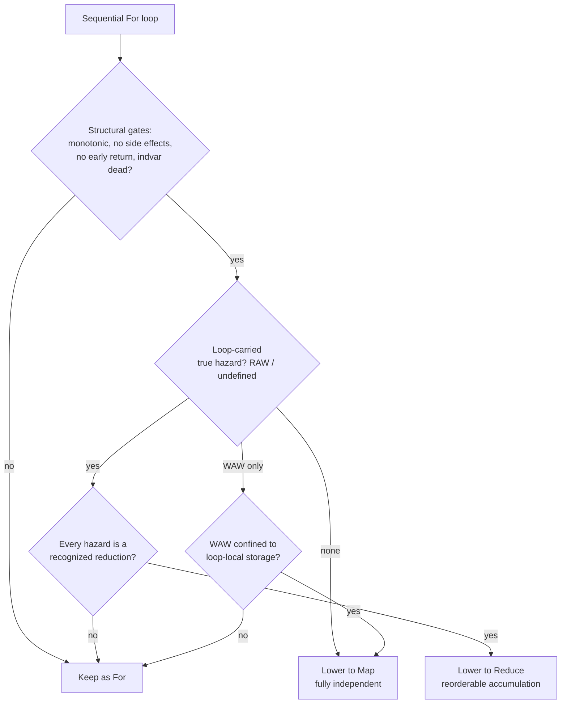

# Auto-Parallelization: Reasoning About Independent Iterations

Most loops in real programs are written *sequentially* — one iteration after another — even when the work of each iteration is completely independent of the others.
A modern machine, however, wants the opposite: dozens of CPU cores, or thousands of GPU threads, each running a different iteration *at the same time*.
The job of auto-parallelization is to look at an ordinary sequential loop and decide, safely and automatically, whether its iterations may be run in any order — including all at once.

Consider the simplest possible loop, adding two arrays element-wise:

```c++
void add(float* A, float* B, float* C, int N) {
    for (int i = 0; i < N; i++) {
        C[i] = A[i] + B[i];
    }
}
```

Iteration `i` reads `A[i]`, `B[i]` and writes `C[i]`.
Iteration `i+1` touches `A[i+1]`, `B[i+1]`, `C[i+1]` — a completely different set of memory cells.
No iteration ever reads a value that another iteration produces, so the iterations do not communicate.
We may run them in reverse, shuffled, or all in parallel, and the result is identical.
This loop is **data-parallel**: in this module it is lowered from a sequential `For` into a `Map`, the parallel-iteration primitive.

Now change one character:

```c++
void prefix(float* A, int N) {
    for (int i = 1; i < N; i++) {
        A[i] = A[i - 1] + A[i];   // reads A[i-1], written by the PREVIOUS iteration
    }
}
```

Iteration `i` reads `A[i-1]` — the exact cell that iteration `i-1` just wrote.
The iterations are now chained: iteration `i` cannot start until iteration `i-1` has finished.
Running them in parallel would let a thread read `A[i-1]` before it has been updated, producing a wrong (and non-deterministic) answer.
This coupling — where an iteration depends on a value produced by an *earlier* iteration of the *same* loop — is called a **loop-carried dependency**, and it is the central obstacle to parallelization.
The whole module exists to answer one question precisely: *does this loop carry a dependency across its iterations, and if so, of what kind?*

## What Is a Loop-Carried Dependency?

A dependency between two memory accesses exists when they touch the *same* memory cell and at least one of them writes.
Two reads of the same cell never conflict — reading is order-independent — so a dependency always involves a write.

A dependency is **loop-carried** when the two conflicting accesses happen in *different iterations* of the loop.
If instead both accesses always happen within the *same* iteration (`C[i] = A[i] + B[i]` reads and writes only index `i`), the dependency is **loop-independent** and harmless to parallelization: each iteration is self-contained.

> **Intuition.** Draw an arrow from every write to every later access of the same cell. If an arrow ever jumps *between* iterations of the loop, that loop is carried. If every arrow stays *inside* a single iteration, the loop is free to run in parallel. Auto-parallelization is the search for those cross-iteration arrows.

**Definition (loop-carried dependency).** For a loop `L` with induction variable $i_L$, two accesses $u$ and $v$ to the same container form a loop-carried dependency if there exist iterations $i_L = a$ and $i_L = b$ with $a \neq b$ such that $u$ (in iteration $a$) and $v$ (in iteration $b$) address the same memory cell, and at least one of $u, v$ is a write.

The *iteration distance* $b - a$ is the **dependence distance**.
In the prefix example, the write `A[i]` and the read `A[i-1]` alias when the write's index equals the read's index, i.e. $a = b - 1$, giving distance $1$: iteration $b$ depends on the iteration one step before it.
This module represents the full set of such distances symbolically as a **delta set** (`symbolic::maps::DependenceDeltas`), computed with the ISL integer-set solver; an *empty* delta set is the proof that no cross-iteration arrow exists.

## The Three Flavors: RAW, WAW, WAR

Since a dependency always involves a write, the two accesses are either (write, read), (write, write), or (read, write).
Classic dependence theory names these by the order in which they occur in the original sequential program:

| Name | Pattern | Also called | Example (carried) |
|---|---|---|---|
| **RAW** | write, then a later read | *true* / *flow* dependence | `A[i] = A[i-1] + x` — read `A[i-1]` after its write |
| **WAW** | write, then a later write | *output* dependence | `M[i%2] = f(i)` — two iterations write the same slot |
| **WAR** | read, then a later write | *anti* dependence | `A[i] = A[i+1]` — write `A[i+1]` after it was read |

The crucial distinction for parallelization is *true* versus *false* dependencies.

- **RAW is a true dependency.** A later iteration genuinely *consumes a value produced* by an earlier one. The data must flow from producer to consumer, so the order is a real constraint that cannot be wished away. A loop-carried RAW is the hazard that blocks parallelization.

- **WAW and WAR are false (name) dependencies.** No value flows between the iterations; they merely *reuse the same storage location*. The conflict is about the *name* of the cell, not about data. Give each iteration its own private copy of that cell (**privatization**), or a fresh name (**renaming**), and the conflict disappears — the iterations become independent.

> **Intuition.** Ask: *does the second access need the value the first one put there?* If yes (RAW), the dependency is real and the loop is sequential in that variable. If the second access is simply going to *overwrite* (WAW) or *stomp on a location that was already read* (WAR), then it does not need the old value — it only needs *somewhere to write*, and giving each iteration its own scratch cell removes the conflict entirely.

A classic example of a removable WAW:

```c++
void scale(float* A, float* B, int N) {
    float t;                          // one shared temporary — a false dependency
    for (int i = 0; i < N; i++) {
        t = A[i] * 2.0f;              // every iteration writes t   (WAW across iterations)
        B[i] = t + 1.0f;              // and reads it back in-iteration (loop-independent)
    }
}
```

Every iteration writes the shared `t`, so `t` carries a WAW dependency.
But no iteration ever needs the `t` value from another iteration — the read of `t` is loop-*independent* (same iteration).
Declaring `t` *inside* the loop gives each iteration its own copy, and the loop parallelizes.
This is why the classifier does not reject a WAW outright: it only requires that the offending container be **loop-local** (privatizable) storage.

## How the Analysis Sees It: `LoopCarriedDependencyAnalysis`

`LoopCarriedDependencyAnalysis` (LCDA) computes, for each loop, exactly which containers carry a cross-iteration dependency and of what kind.
It does not scan every pair of statements blindly; it rides on top of `DataDependencyAnalysis` (DDA), which already summarizes each loop by two boundary sets:

- **upward-exposed reads** $\mathrm{ue}(L)$ — reads inside the loop that consume a value from *outside* the current iteration (a candidate *consumer*);
- **escaping definitions** $\mathrm{esc}(L)$ — writes inside the loop whose value is still live at the iteration boundary (a candidate *producer*).

A cross-iteration arrow can only run from a producer to a consumer, so LCDA only has to test those two boundary sets against each other:

$$
\begin{aligned}
\text{pairs}(L) \;=\; &\{\, (W, R,\ \textbf{RAW},\ \Delta_L(W,R)) : W \in \mathrm{esc}(L),\ R \in \mathrm{ue}(L),\ \mathrm{cont}(W)=\mathrm{cont}(R),\ \Delta \neq \varnothing \,\} \\
\cup\; &\{\, (W_1, W_2,\ \textbf{WAW},\ \Delta_L(W_1,W_2)) : W_1, W_2 \in \mathrm{esc}(L),\ \mathrm{cont}(W_1)=\mathrm{cont}(W_2),\ \Delta \neq \varnothing \,\}
\end{aligned}
$$

For each candidate pair it calls `symbolic::maps::dependence_deltas`, which asks ISL whether the two index expressions can ever alias across iterations, and if so returns the delta set $\Delta$.
An empty $\Delta$ is a *proof of independence*; a non-empty $\Delta$ records a real loop-carried dependency together with its distances.
The enum `LoopCarriedDependency` labels the result:

- `LOOP_CARRIED_DEPENDENCY_READ_WRITE` — a RAW (true) hazard,
- `LOOP_CARRIED_DEPENDENCY_WRITE_WRITE` — a WAW (false, potentially privatizable),
- `LOOP_CARRIED_DEPENDENCY_UNDEFINED` — a dependency exists but its distance is *unrepresentable*, so it must be treated conservatively as a hazard.

> **Why precision matters.** A linearized access like `A[i*N + j]` hides its structure from ISL. LCDA therefore pulls *delinearized* subsets (`[i, j]`) from `MemoryLayoutAnalysis` when available, and uses a branch-condition-aware `AssumptionsAnalysis`, so that halo-style patterns whose accesses only *appear* to overlap can be proven independent rather than conservatively rejected.

The undefined case covers what the algebra cannot pin down: two accesses to a **scalar** (any two touch the same single cell, so a dependency certainly exists, but there is no meaningful distance vector), or **indirect** accesses like `A[B[i]]` whose index is itself data-dependent. When in doubt, the analysis reports a hazard — soundness over optimism.

## From Hazard to Decision: `ForClassificationPass`

`LoopCarriedDependencyAnalysis` describes the dependencies; `ForClassificationPass` *acts* on them.
It examines every `For` loop against a single set of legality criteria and lowers it to one of three outcomes:

| Outcome | Meaning | Condition |
|---|---|---|
| `Map` | iterations are fully independent | no loop-carried hazard remains |
| `Reduce` | the only carried dependencies are reorderable accumulations | every hazard is a recognized reduction |
| `For` (unchanged) | a genuine hazard remains | a true dependency that is neither removable nor a reduction |

Beyond the dependency test, a loop must also clear a few structural gates before it may become a `Map` or `Reduce`:

- a **monotonic** loop bound (a well-defined, countable iteration space),
- **no side effects** in the body (no I/O, no side-effecting library calls),
- **no early `Return`** escaping the loop,
- the **induction variable is dead** after the loop (its final value is not observed), and
- every **false (WAW) dependency is confined to loop-local storage** — the privatization condition from the `scale` example above. A container carrying a WAW that is *not* loop-local (and is not a reduction accumulator, nor a trivial constant-scalar assignment) blocks the transform.

> **Intuition.** `Map` is the reward for a loop that carries *no true dependency and no un-privatizable name conflict*. Everything the classifier checks is a way of confirming that each iteration is a self-contained unit of work whose only outputs are distinct memory cells.

## Reductions: A True Dependency That Is Still Parallel

Not every RAW is fatal. Consider a sum:

```c++
float sum(float* A, int N) {
    float acc = 0.0f;
    for (int i = 0; i < N; i++) {
        acc = acc + A[i];        // reads acc (written by the previous iteration): a loop-carried RAW
    }
    return acc;
}
```

`acc` is read and written every iteration, and the read consumes the previous iteration's write — a textbook loop-carried RAW.
Taken literally, this loop is sequential.
Yet we *know* a sum can be computed in parallel: split the array into chunks, sum each chunk on its own thread, then combine the partial sums.
This works because addition is **associative and commutative** — the order in which we combine the elements does not change the result.

A loop-carried RAW of this special shape — an accumulator updated by a single associative/commutative operator, `acc = acc OP x`, over one fixed loop-invariant location — is a **reduction**.
It is loop-carried (so the loop is not a plain `Map`) yet *reorderable* (so it can still run in parallel, as a `Reduce`).

`LoopCarriedDependencyAnalysis::detect_reductions` recognizes these precisely. For each loop-carried read-write container it checks that:

1. the accumulator is produced by **exactly one** combine node whose operator is one of `Add`, `Mul`, `Min`, `Max` (`combine_operator` maps tasklets and CMath nodes — including `fma` over its addend — to a `ReductionOperation`);
2. that same combine **reads the accumulator back** (`acc = acc OP x`, not `acc = b OP x`); and
3. the accumulator addresses **one fixed, loop-invariant cell** — the written and read-back addresses are proven equal on the iteration domain by `symbolic::polyhedral::equal_on_domain`, and the address is guarded to not move with the induction variable.

Each recognized reduction becomes a `ReductionInfo { operation, container }`.
`is_reduction_only` then answers the decisive question: *are all of the loop's true hazards reductions?*
If so, `ForClassificationPass` emits a `Reduce` (carrying the operators to combine the partial results); the accumulator's cross-iteration WAW/RAW is handled by the reduction machinery rather than counted as a hazard.

## The Whole Decision, at a Glance



The pipeline `data_parallelism()` wires this together: `ForClassificationPass` makes the decision, then `SymbolPropagation` and `DeadDataElimination` clean up the induction variables and temporaries the transform leaves behind.

## Summary

- A **dependency** links two accesses to the same cell where at least one writes; it is **loop-carried** when the two accesses fall in *different iterations*.
- Loop-carried dependencies come in three flavors: **RAW** (true — a value flows across iterations, a real hazard), **WAW** and **WAR** (false — mere storage reuse, removable by privatization/renaming).
- `LoopCarriedDependencyAnalysis` computes them precisely, pairing `DataDependencyAnalysis`'s producer/consumer boundary sets and asking ISL for the **delta set** of cross-iteration distances; an empty delta set is a proof of independence.
- `ForClassificationPass` turns the verdict into a transform: **`Map`** when nothing true is carried, **`Reduce`** when the only carried dependencies are associative/commutative **reductions**, and an untouched **`For`** when a genuine hazard survives.
